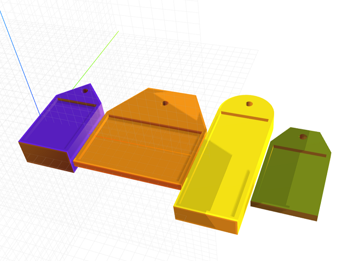

# craft-tag

Parameterized tag model.

### Install
    $ npm install craft-tag

### Parameters
- width: adjusts width of tag
    - default: 15
- length: adjusts length of tag
    - default: 20
- height: adjusts thickness of tag
    - default: 2
- type: adjusts between tag types
    - 1 = triangular head
    - 2 = trapezoidal head (default)
    - 3 = rounded head
- indent: adjusts between tag and indented tag
    - 0 = not indented
    - 1 = indented (default)

### Example
```html
<craft>
    <craft name="tag" module="craft-tag"/>
    <row spacing="1">
        <tag type="1" height="8"></tag>
        <tag width="30"></tag>
        <tag type="3" length="35" height="5"></tag>
        <tag></tag>
    </row>
</craft>
```


